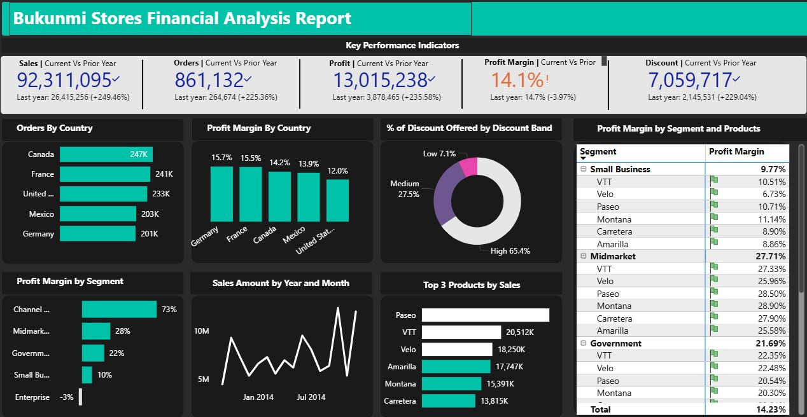

# Bukunmi Stores – Financial Analysis (Power BI)

## 🖼️ Dashboard Preview



An interactive Power BI report that provides a complete financial overview of **Bukunmi Stores**.  
It highlights sales, profit, discount behavior, and key performance indicators across countries, segments, and products.

---

## 📊 Key Insights from the Dashboard

| Metric | Current Year | Prior Year | YoY Change |
|-------|-------------|-----------|-----------|
| **Sales** | 92,311,095 | 26,415,256 | **+249.46%** |
| **Orders** | 861,132 | 264,674 | **+225.36%** |
| **Profit** | 13,015,238 | 3,878,465 | **+235.58%** |
| **Profit Margin** | 14.1 % | 14.7 % | **−3.97 %** |
| **Discount** | 7,059,717 | 2,145,531 | **+229.04%** |

### Country Highlights
- **Top Orders:** Canada (247 K), France (241 K), United States (233 K).
- **Highest Profit Margin:** Germany (15.7 %), followed by France (15.5 %).

### Segment & Product Insights
- **Midmarket** segment drives **27.7 %** profit margin—the highest of all.
- Top-selling product: **Paseo**, followed by **VTT** and **Velo**.

### Discounts
- High-discount band accounts for **65.4 %** of all discounts—an important lever for margin control.

---

## 🔧 Data & Tools
- **Data Source:** Bukunmi Stores transactional sales data (sample / anonymized).
- **Visualization Tool:** [Microsoft Power BI](https://powerbi.microsoft.com/).
- **Techniques:** Data modeling (star schema), DAX measures, interactive slicers, custom KPIs.

---

## 🗂️ Project Structure

<pre><code> ``` Financial-Analysis---PowerBI/ │ ├── data/ # raw and cleaned data files ├── dashboard.pbix # Power BI report file ├── images/overview.jpg # exported dashboard screenshot └── README.md ``` </code></pre>


---

## 🚀 How to View the Report
1. **Download the `.pbix` file** from this repository.
2. Open it in [Power BI Desktop](https://powerbi.microsoft.com/desktop/).
3. Interact with filters and visuals to explore metrics by time, country, and segment.

---

## 📈 Possible Extensions
- Integrate with a live database for automatic refresh.
- Add predictive models (e.g., sales forecasting with DAX/ML).
- Publish to Power BI Service for web access and scheduled updates.

---

## 🖼️ Dashboard Preview


---

## 💡 Author
**Bukunmi Soniran**  
Data Analyst • Power BI & Analytics Enthusiast

Feel free to fork, explore, and suggest improvements!
